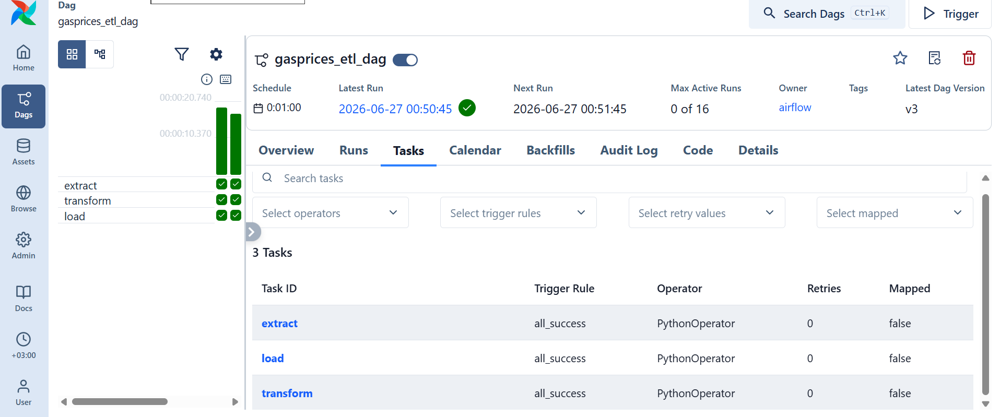
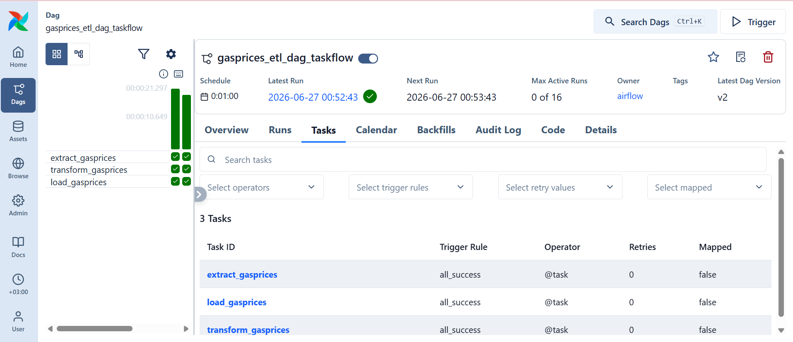

# Airflow Gas Prices ETL Pipelines

This repository showcases two different architectural styles of an Apache Airflow pipeline that extracts gas prices from an API, transforms the data using Pandas, and loads it into a PostgreSQL database.

## 1. Standard Pipeline (PythonOperator)
This version utilizes traditional PythonOperators and explicit XCom keys.

### Airflow Grid View & Task Success Status

## 2. Refactored Pipeline (TaskFlow API)
This version optimizes the codebase using modern `@dag` and `@task` decorators.

### Airflow Grid View & Task Success Status

